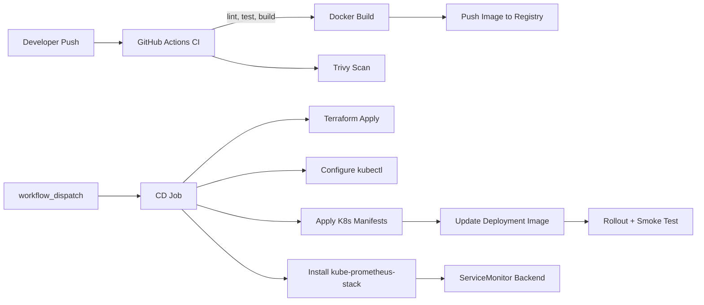
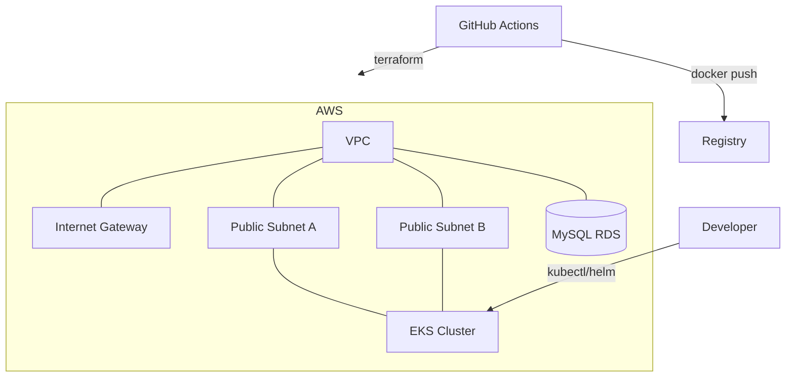

# DevOps Report

## Technologies Used
- Backend: Express.js, Prisma (MySQL)
- Frontend: React (react-scripts)
- Containerization: Docker, Docker Compose
- IaC: Terraform (AWS VPC, RDS, EKS)
- Kubernetes: Deployments, Services, Ingress, ConfigMaps, Secrets
- CI/CD: GitHub Actions (build, lint, scan, Docker push, manual deploy)
- Monitoring: kube-prometheus-stack (Prometheus, Grafana, node-exporter, kube-state-metrics)
- Security & Scans: Trivy filesystem and image scans
- Secrets: GitHub Actions secrets, Kubernetes Secret, AWS credentials via OIDC or static keys

## Pipeline Diagram

## Infrastructure Diagram

## Secret Management Strategy
- CI/CD:
  - `DOCKER_USERNAME` / `DOCKER_PASSWORD` used for Docker Hub login.
  - `AWS_ACCESS_KEY_ID` / `AWS_SECRET_ACCESS_KEY` set via Actions secrets (or OIDC role for better security).
- Application:
  - `DATABASE_URL` injected via Kubernetes `Secret` in `dev` namespace.
  - Avoid committing `.env` with live credentials; use sample files for local dev.
- Terraform:
  - Parameterize sensitive values (e.g., DB password) via `-var` or environment variables.
  - Prefer AWS IAM Roles for Service Accounts (IRSA) to avoid static creds in-cluster.

## Monitoring Strategy
- Stack: kube-prometheus-stack provides Prometheus, Grafana, node-exporter, kube-state-metrics.
- App metrics: backend exposes `/metrics` via prom-client; scraped using `ServiceMonitor` in `monitoring`.
- Dashboards:
  - Kubernetes/Nodes CPU & Memory
  - Kubernetes/Pods metrics for backend
  - Custom panel: `sum by (route) (rate(http_requests_total[5m]))`
- Access:
  - Grafana via NodePort 32000 or port-forward; admin cred set in `k8s/monitoring-values.yaml`.

## Lessons Learned
- Align secrets and environment variable names between docs and pipelines to avoid confusion.
- Ensure CRDs (e.g., ServiceMonitor) exist before applying custom resources; Helm install order matters.
- Add `/metrics` early to the app so image updates immediately provide visibility.
- Prefer IRSA over static AWS keys for production; keep static keys for classroom/demo only.
- Use `--wait` and rollout checks in CD to reduce flakiness under Kubernetes.
